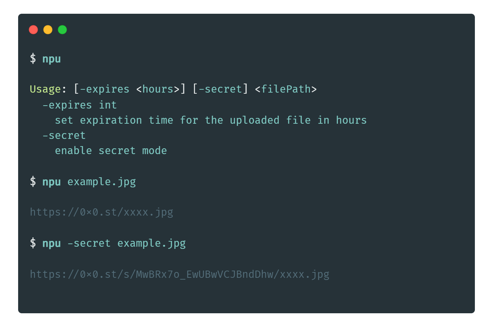

# npu

# 

Simple GO client for [The Null Pointer](https://0x0.st/) file-sharing service.

## How it works

When executed, the program reads the specified file and creates a multipart/form-data POST request to send to the 0x0.st API. The uploaded file is included as a form file with the name file. The expiration and secret options, if specified, are also included as form fields.

Upon a successful upload, the program outputs the URL to the uploaded file to the console and also **writes it to the clipboard**.

## License

The code in this repository is licensed under the MIT License. See LICENSE for more information.
